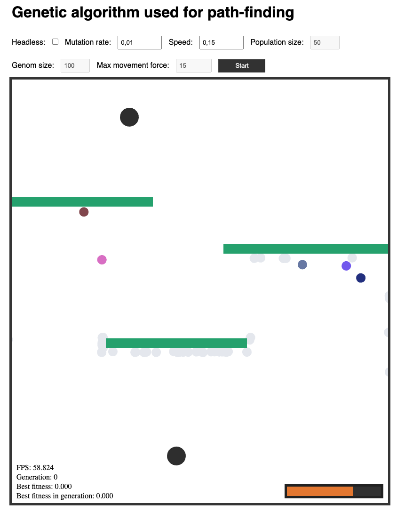

# Genetic algorithm used for path-finding

Tournament or Rank selection is used for selecting from the population. For mutations are one point cross over used. 

[Demo link](https://trolund.github.io/Genetic-algorithm-path-finding/)

